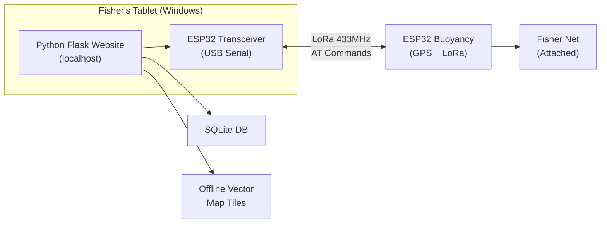

# OceanNav Buoyancy Tracking System — Full Rebuild

A complete rebuild of the OceanNav fisher-net tracking system with a modular Python Flask backend, SQLite database, serial ESP32/LoRa communication, offline vector maps, and role-based access control.

## Background & System Architecture



**Communication Protocol** (from firmware analysis):
- Format: `<TRX_ID,BUOY_ID>,AT+COMMAND`
- AT Commands: `SCAN`, `BIND`, `CGPS`, `CGPSINFO`, `BSOC`, `LED`
- GPS Response: `+CGPSINFO:lat,lon,date,time,alt,speed,course,sats,hdop`
- LoRa Frequency: 433 MHz

---

## Proposed Changes

### Component 1: Project Structure

The new project at `c:\Janith\Buoyancy new\` will have this clean modular layout:

```
c:\Janith\Buoyancy new\
├── app/
│   ├── __init__.py              # Flask app factory
│   ├── config.py                # Configuration constants
│   ├── database.py              # SQLite DB init & helpers
│   ├── models.py                # Data models / DB schema
│   ├── routes/
│   │   ├── __init__.py          # Blueprint registration
│   │   ├── auth.py              # Login, signup, logout
│   │   ├── dashboard.py         # Dashboard page route
│   │   ├── live_map.py          # Live map page route
│   │   ├── devices.py           # Device setup page + API
│   │   ├── users.py             # Users management page + API
│   │   ├── settings.py          # Settings page + API
│   │   ├── serial_api.py        # Serial port APIs (connect, scan, GPS)
│   │   └── tiles.py             # Offline vector tile server
│   ├── services/
│   │   ├── __init__.py
│   │   ├── serial_service.py    # Serial port management & listener
│   │   └── lora_protocol.py     # AT command builder & response parser
│   ├── static/
│   │   ├── css/
│   │   │   ├── base.css         # Global variables, reset, sidebar
│   │   │   ├── login.css        # Login/signup page styles
│   │   │   ├── dashboard.css    # Dashboard page styles
│   │   │   ├── live_map.css     # Live map page styles
│   │   │   ├── devices.css      # Device setup page styles
│   │   │   ├── users.css        # Users page styles
│   │   │   └── settings.css     # Settings page styles
│   │   ├── js/
│   │   │   ├── main.js          # Common JS (theme, sidebar, nav)
│   │   │   ├── auth.js          # Login/signup logic
│   │   │   ├── dashboard.js     # Dashboard logic + mini map
│   │   │   ├── live_map.js      # Live map logic + buoy tracking
│   │   │   ├── devices.js       # Device setup logic
│   │   │   ├── users.js         # Users management logic
│   │   │   └── settings.js      # Settings logic
│   │   ├── map-style.json       # MapLibre GL vector style
│   │   └── maplibre/            # MapLibre GL JS library (offline)
│   └── templates/
│       ├── base.html            # Base template with sidebar
│       ├── login.html           # Login / Register page
│       ├── dashboard.html       # Dashboard page
│       ├── live_map.html        # Live Map page
│       ├── devices.html         # Device Setup page
│       ├── users.html           # Users management page
│       └── settings.html        # Settings page
├── srilanka map/                # (existing) .mbtiles file
├── Buoyancy/                    # (existing) ESP32 buoyancy firmware
├── Transceiver/                 # (existing) ESP32 transceiver firmware
├── run.py                       # Entry point
└── requirements.txt             # Python dependencies
```

---

### Component 2: Database (SQLite)

#### [NEW] [database.py](file:///c:/Janith/Buoyancy%20new/app/database.py)
#### [NEW] [models.py](file:///c:/Janith/Buoyancy%20new/app/models.py)

**Tables:**

| Table | Purpose |
|-------|---------|
| `users` | User accounts with role-based access |
| `devices` | Registered buoyancy devices |
| `gps_logs` | Historical GPS location records |
| `settings` | Application settings (key-value) |

**Users Table:**
```sql
CREATE TABLE users (
    id INTEGER PRIMARY KEY AUTOINCREMENT,
    name TEXT NOT NULL,
    email TEXT UNIQUE NOT NULL,
    password TEXT NOT NULL,  -- hashed with werkzeug
    role TEXT NOT NULL CHECK(role IN ('super_admin','admin','user')),
    status TEXT DEFAULT 'Active',
    last_active TEXT DEFAULT 'Now',
    avatar TEXT NOT NULL,
    avatar_bg TEXT NOT NULL,
    created_at TIMESTAMP DEFAULT CURRENT_TIMESTAMP
);
```

**Devices Table:**
```sql
CREATE TABLE devices (
    id TEXT PRIMARY KEY,           -- ESP32 chip ID (12-char hex)
    name TEXT,
    lat REAL DEFAULT 0.0,
    lon REAL DEFAULT 0.0,
    battery INTEGER DEFAULT 100,
    status TEXT DEFAULT 'offline', -- online/warning/offline
    gps_status TEXT DEFAULT 'unknown', -- locked/no_lock/unknown
    last_gps_time TEXT,
    registered_at TIMESTAMP DEFAULT CURRENT_TIMESTAMP,
    registered_by TEXT,            -- user email who registered it
    active INTEGER DEFAULT 1
);
```

**GPS Logs Table:**
```sql
CREATE TABLE gps_logs (
    id INTEGER PRIMARY KEY AUTOINCREMENT,
    device_id TEXT,
    lat REAL NOT NULL,
    lon REAL NOT NULL,
    source TEXT DEFAULT 'live',    -- live/cached/database
    timestamp TIMESTAMP DEFAULT CURRENT_TIMESTAMP
);
```

**Settings Table:**
```sql
CREATE TABLE settings (
    key TEXT PRIMARY KEY,
    value TEXT,
    updated_at TIMESTAMP DEFAULT CURRENT_TIMESTAMP
);
```

**Hardcoded Super Admin** (seeded on first run):
- Name: `Super Admin`
- Email: `superadmin@oceannav.lk`
- Password: `superadmin123` (hashed)
- Role: `super_admin`

---

### Component 3: Authentication & Authorization

#### [NEW] [auth.py](file:///c:/Janith/Buoyancy%20new/app/routes/auth.py)

| Feature | Details |
|---------|---------|
| Registration | Users register with name, email, password |
| Login | Email + password → session-based auth |
| Password hashing | `werkzeug.security.generate_password_hash` / `check_password_hash` |
| Role hierarchy | `super_admin` > `admin` > `user` |
| Super Admin | Hardcoded, can change any user's role |
| Admin | Can access Users page, cannot change roles |
| User | Cannot access Users page (sidebar hides it) |
| Page protection | Flask `@login_required` decorator + role checks |

---

### Component 4: Dashboard Page

#### [NEW] [dashboard.html](file:///c:/Janith/Buoyancy%20new/app/templates/dashboard.html)
#### [NEW] [dashboard.js](file:///c:/Janith/Buoyancy%20new/app/static/js/dashboard.js)
#### [NEW] [dashboard.css](file:///c:/Janith/Buoyancy%20new/app/static/css/dashboard.css)

| Feature | Details |
|---------|---------|
| Stats Cards | Total Buoys, Active Buoys, Signal Lost (smaller, compact) |
| Mini Map | MapLibre GL vector map (from mbtiles) showing user's live GPS location |
| User Location | Blue pulsing dot for user's position (via browser geolocation API) |
| Nearby Buoys | Show registered buoys within 5km range of user |
| LoRa Range Circle | 1km radius circle around user (shows LoRa effective range) |
| Buoy Details | Small info cards for nearby buoys with lat, lon, status |

---

### Component 5: Live Map Page

#### [NEW] [live_map.html](file:///c:/Janith/Buoyancy%20new/app/templates/live_map.html)
#### [NEW] [live_map.js](file:///c:/Janith/Buoyancy%20new/app/static/js/live_map.js)
#### [NEW] [live_map.css](file:///c:/Janith/Buoyancy%20new/app/static/css/live_map.css)

| Feature | Details |
|---------|---------|
| Full Map | Full-size MapLibre GL vector map |
| User Location | Live user GPS position |
| Buoy Markers | All registered buoys on map from DB |
| Side Panel | Buoy details list (searchable) |
| Click to Locate | Click buoy in side panel → map zooms & highlights |
| Toggle Highlight | Click again → dehighlights |
| **Scan GPS Button** | Sends `AT+SCAN` to ALL buoys, then `AT+CGPSINFO` to each |
| **Update Button** | Per-buoy update: requests latest GPS from that buoy via LoRa |
| **Color Coding** | |
| — 🟢 Green | In LoRa range + GPS lock → live location |
| — 🟡 Yellow | In LoRa range + responded but no GPS lock |
| — 🔴 Red | Registered but no LoRa response |
| No "Connect ESP32" button | Removed as requested |
| Fallback Location | If buoy responds but GPS fails → show last saved DB location + alert |

---

### Component 6: Device Setup Page

#### [NEW] [devices.html](file:///c:/Janith/Buoyancy%20new/app/templates/devices.html)
#### [NEW] [devices.js](file:///c:/Janith/Buoyancy%20new/app/static/js/devices.js)
#### [NEW] [devices.css](file:///c:/Janith/Buoyancy%20new/app/static/css/devices.css)

| Feature | Details |
|---------|---------|
| COM Port Selector | Select transceiver COM port + Connect/Refresh buttons |
| Registered Devices List | Shows all buoys with: ID, Name, Lat, Lon, Register Date, Last Updated |
| Add Device | Register new buoy by Device ID (ESP32 chip ID) |
| **Get Buoy ID** | Connect buoy directly to tablet USB → select COM port → press button → reads ESP32 chip ID from serial boot output → auto-fills Device ID field |
| Delete Device | Remove buoy from database |
| Locate Button | Zoom to buoy location on Live Map |
| Details Display | Lat, Lon, registered date, last location update time |

---

### Component 7: Users Page

#### [NEW] [users.html](file:///c:/Janith/Buoyancy%20new/app/templates/users.html)
#### [NEW] [users.js](file:///c:/Janith/Buoyancy%20new/app/static/js/users.js)
#### [NEW] [users.css](file:///c:/Janith/Buoyancy%20new/app/static/css/users.css)

| Feature | Details |
|---------|---------|
| Access Control | Hidden from sidebar for `user` role; visible for `admin` + `super_admin` |
| User Table | Name, Email, Role, Status, Last Active |
| **Super Admin Actions** | Change role dropdown, Add user, Delete user |
| **Admin Actions** | View only (cannot modify roles) |
| Role badges | Color-coded: Super Admin (purple), Admin (red), User (cyan) |

---

### Component 8: Settings Page

#### [NEW] [settings.html](file:///c:/Janith/Buoyancy%20new/app/templates/settings.html)
#### [NEW] [settings.js](file:///c:/Janith/Buoyancy%20new/app/static/js/settings.js)
#### [NEW] [settings.css](file:///c:/Janith/Buoyancy%20new/app/static/css/settings.css)

Matches the old design with 4 settings panels. Settings are stored in the `settings` DB table and will be functional:

| Panel | Settings |
|-------|----------|
| **Device Settings** | Auto-scan GPS (toggle), Auto-connect on startup (toggle), Baud Rate (input), GPS Poll Interval (input) |
| **Map Settings** | Show buoy trails (toggle), Auto-center on GPS update (toggle), Default Zoom Level (input), Offline tiles cache (toggle) |
| **Alert Settings** | Low battery alert (toggle + threshold), Offline buoy alert (toggle), GPS drift alert (toggle + distance) |
| **Security** | Two-factor auth (toggle, placeholder), Session timeout (input, minutes), API access logs (toggle) |

Each panel has a **Save Changes** button that persists to the database.

---

### Component 9: Serial Communication Service

#### [NEW] [serial_service.py](file:///c:/Janith/Buoyancy%20new/app/services/serial_service.py)
#### [NEW] [lora_protocol.py](file:///c:/Janith/Buoyancy%20new/app/services/lora_protocol.py)

| Feature | Details |
|---------|---------|
| `SerialService` class | Manages serial connection lifecycle |
| Background listener thread | Parses all incoming serial data continuously |
| `LoRaProtocol` class | Builds AT commands, parses responses |
| TRX ID detection | Reads transceiver chip ID from boot output |
| CGPSINFO parsing | Extracts lat, lon, date, time, altitude, speed, satellites, hdop |
| SCAN response parsing | Detects which buoys respond |
| BIND management | Bind/unbind buoys to transceiver |
| Device ID reader | Connect buoy to USB → reads chip ID from boot sequence |

**AT Command Flow for Scan GPS:**
```
1. Website → Transceiver: <TRX_ID,ALL>,AT+SCAN
2. Each buoy responds: <TRX_ID,BUOY_ID>+SCAN:BUOY_ID OK
3. For each responded buoy:
   Website → Transceiver: <TRX_ID,BUOY_ID>,AT+CGPSINFO
4. Buoy responds with GPS data or error
5. Website updates map colors accordingly
```

**AT Command Flow for Update (per buoy):**
```
1. Website → Transceiver: <TRX_ID,BUOY_ID>,AT+CGPSINFO
2. If buoy responds with GPS → update DB + map (green)
3. If buoy responds but no GPS lock → use last saved location + alert (yellow)
4. If no response → show DB location + alert "out of range" (red)
```

---

### Component 10: ESP32 Buoyancy Firmware Updates

#### [MODIFY] [main.cpp](file:///c:/Janith/Buoyancy%20new/Buoyancy/src/main.cpp) and related libraries

> [!IMPORTANT]
> The buoyancy firmware needs modifications for battery saving (CAD mode) and cached GPS locations.

| Feature | Details |
|---------|---------|
| **LoRa CAD Mode** | Sleep 2 seconds → wake for 1ms CAD detection → if preamble detected, fully wake ESP32 and process → else sleep again |
| **Periodic GPS** | Get live GPS location every 1 hour |
| **Location Cache** | Save last 5 GPS locations in ESP32 NVS (Preferences) → delete older ones |
| **Fallback Location** | If transceiver requests location and GPS can't lock → send last cached location with a `CACHED` flag |
| **Response Format** | Modified `+CGPSINFO` to include source flag: `+CGPSINFO:lat,lon,...,LIVE` or `+CGPSINFO:lat,lon,...,CACHED` |

**New firmware flow:**
```
┌─────────────┐
│  Deep Sleep  │
│  (2 seconds) │
└──────┬──────┘
       │
       ▼
┌─────────────┐    No signal    ┌──────────────┐
│  CAD Check   │───────────────→│  Back to      │
│  (~1ms)      │                │  Sleep        │
└──────┬──────┘                └──────────────┘
       │ Signal detected
       ▼
┌─────────────┐
│  Wake Up     │
│  Process AT  │
│  Command     │
└──────┬──────┘
       │
       ▼
┌─────────────┐
│  Send        │
│  Response    │
└──────┬──────┘
       │
       ▼
┌─────────────┐
│  Back to     │
│  Sleep       │
└─────────────┘

Every 1 hour timer:
┌─────────────┐
│  Wake Up     │
│  Get GPS Fix │
│  Save to NVS │
│  (max 5)     │
│  Sleep       │
└─────────────┘
```

---

### Component 11: Map Integration

#### [NEW] [tiles.py](file:///c:/Janith/Buoyancy%20new/app/routes/tiles.py)

| Feature | Details |
|---------|---------|
| Tile Source | `srilanka map/osm-2020-02-10-v3.11_asia_sri-lanka.mbtiles` |
| Library | MapLibre GL JS (bundled offline in `static/maplibre/`) |
| Style | Custom vector style JSON with water, land, roads, boundaries |
| Tile Format | PBF (protobuf) with gzip encoding, TMS Y-flip |
| Caching | 1-year cache headers for performance |

---

## Open Questions

> [!IMPORTANT]
> **Q1: MapLibre GL JS offline files** — The old project has a `maplibre/` directory in static. Should I copy those files to the new project, or do you have a specific version you want to use?

> [!IMPORTANT]  
> **Q2: Password for Super Admin** — I've set `superadmin123` as default. Should I change this to something else?

> [!IMPORTANT]
> **Q3: Email domain restriction** — The old code restricted signup to `@gmail.com`. Should I keep this restriction or allow any email?

> [!IMPORTANT]
> **Q4: ESP32 firmware changes** — The CAD mode and GPS caching require significant firmware changes. Should I implement those in this same plan, or would you prefer to do the website first and firmware separately?

---

## User Review Required

> [!WARNING]
> **Breaking Change**: This is a complete rebuild. The old `main.py` (single 1500-line file) will NOT be modified. The new project is built from scratch in the `c:\Janith\Buoyancy new\` workspace with a clean modular architecture.

> [!IMPORTANT]
> **Database Migration**: A new SQLite database (`oceannav.db`) will be created in the new project. Old data from the previous project will NOT be automatically migrated.

---

## Verification Plan

### Automated Tests
- Run `python run.py` and verify server starts without errors
- Test all API endpoints via browser
- Verify serial communication with ESP32 transceiver
- Test role-based access (login as user vs admin vs super_admin)

### Manual Verification
- Login/Register flow works correctly
- Dashboard shows mini map with user location + nearby buoys + 1km circle
- Live Map shows all buoys with correct color coding after Scan GPS
- Device Setup can read buoy ID from USB, register devices, locate on map
- Users page hidden for regular users, visible for admin/super_admin
- Settings save and persist across page reloads
- Vector map tiles render correctly from offline mbtiles
- Theme toggle (dark/light) works across all pages
